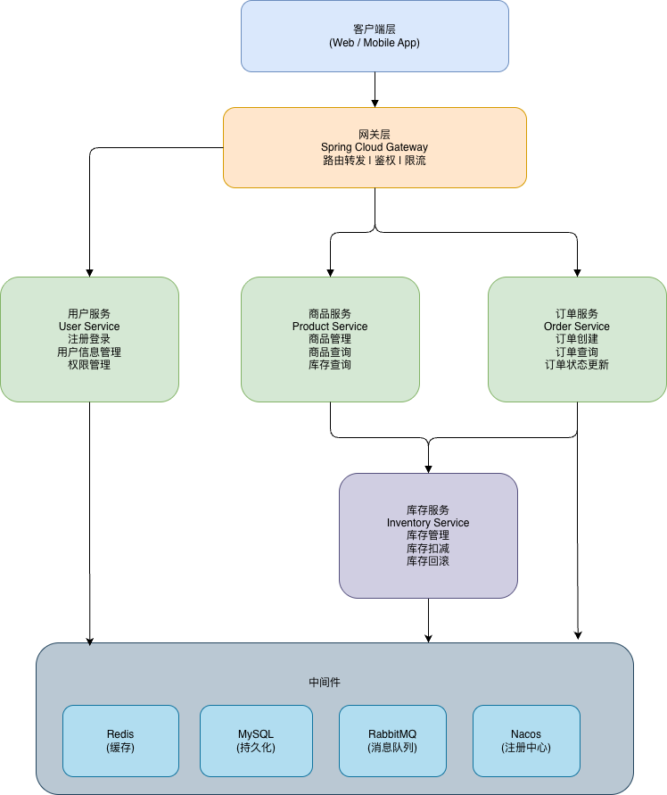

# 商品库存与秒杀系统设计文档

## 1. 系统架构设计

### 1.1 系统架构图



### 1.2 服务拆分说明

#### 用户服务 (User Service)

- 负责用户注册、登录、身份验证
- 用户信息管理（个人资料、地址等）
- JWT Token 生成与验证

#### 商品服务 (Product Service)

- 商品信息的增删改查
- 商品分类管理
- 商品详情查询
- 秒杀商品管理

#### 库存服务 (Inventory Service)

- 库存实时查询
- 库存扣减（支持分布式锁）
- 库存回滚（订单取消时）
- 库存预警

#### 订单服务 (Order Service)

- 订单创建
- 订单状态管理
- 订单支付流程
- 订单查询与取消

## 2. API 接口设计 (RESTful)

### 2.1 用户服务 API

| 接口路径             | 方法 | 描述         | 请求参数                                | 响应                                               |
| -------------------- | ---- | ------------ | --------------------------------------- | -------------------------------------------------- |
| `/api/user/register` | POST | 用户注册     | `{username, password, email, phone}`    | `{code, message, data: {userId, token}}`           |
| `/api/user/login`    | POST | 用户登录     | `{username, password}`                  | `{code, message, data: {userId, username, token}}` |
| `/api/user/info`     | GET  | 获取用户信息 | Header: `Authorization: Bearer {token}` | `{code, message, data: {user}}`                    |
| `/api/user/profile`  | PUT  | 更新用户信息 | `{email, phone, address}`               | `{code, message}`                                  |
| `/api/user/logout`   | POST | 用户登出     | Header: `Authorization: Bearer {token}` | `{code, message}`                                  |

### 2.2 商品服务 API

| 接口路径                    | 方法   | 描述             | 请求参数                                        | 响应                                       |
| --------------------------- | ------ | ---------------- | ----------------------------------------------- | ------------------------------------------ |
| `/api/product/list`         | GET    | 获取商品列表     | `?page=1&size=10&category=`                     | `{code, message, data: {products, total}}` |
| `/api/product/{id}`         | GET    | 获取商品详情     | 路径参数: `id`                                  | `{code, message, data: {product}}`         |
| `/api/product/create`       | POST   | 创建商品         | `{name, price, description, categoryId, stock}` | `{code, message, data: {productId}}`       |
| `/api/product/{id}`         | PUT    | 更新商品         | `{name, price, description, stock}`             | `{code, message}`                          |
| `/api/product/{id}`         | DELETE | 删除商品         | 路径参数: `id`                                  | `{code, message}`                          |
| `/api/product/seckill/list` | GET    | 获取秒杀商品列表 | `?status=ongoing`                               | `{code, message, data: {products}}`        |

### 2.3 库存服务 API

| 接口路径                     | 方法 | 描述     | 请求参数                         | 响应                                        |
| ---------------------------- | ---- | -------- | -------------------------------- | ------------------------------------------- |
| `/api/inventory/{productId}` | GET  | 查询库存 | 路径参数: `productId`            | `{code, message, data: {stock, available}}` |
| `/api/inventory/deduct`      | POST | 扣减库存 | `{productId, quantity, orderId}` | `{code, message, data: {success}}`          |
| `/api/inventory/rollback`    | POST | 回滚库存 | `{productId, quantity, orderId}` | `{code, message}`                           |
| `/api/inventory/update`      | PUT  | 更新库存 | `{productId, stock}`             | `{code, message}`                           |

### 2.4 订单服务 API

| 接口路径                      | 方法 | 描述         | 请求参数                          | 响应                                        |
| ----------------------------- | ---- | ------------ | --------------------------------- | ------------------------------------------- |
| `/api/order/create`           | POST | 创建订单     | `{productId, quantity, userId}`   | `{code, message, data: {orderId, orderNo}}` |
| `/api/order/{orderId}`        | GET  | 查询订单详情 | 路径参数: `orderId`               | `{code, message, data: {order}}`            |
| `/api/order/list`             | GET  | 查询订单列表 | `?userId=&status=&page=1&size=10` | `{code, message, data: {orders, total}}`    |
| `/api/order/{orderId}/cancel` | POST | 取消订单     | 路径参数: `orderId`               | `{code, message}`                           |
| `/api/order/{orderId}/pay`    | POST | 支付订单     | `{paymentMethod}`                 | `{code, message, data: {paymentUrl}}`       |
| `/api/order/seckill`          | POST | 秒杀下单     | `{productId, userId, token}`      | `{code, message, data: {orderId}}`          |

## 3. 数据库设计 (ER 图)

### 3.1 用户表 (user)

```sql
CREATE TABLE `user` (
  `id` BIGINT PRIMARY KEY AUTO_INCREMENT COMMENT '用户ID',
  `username` VARCHAR(50) NOT NULL UNIQUE COMMENT '用户名',
  `password` VARCHAR(100) NOT NULL COMMENT '密码(加密)',
  `email` VARCHAR(100) COMMENT '邮箱',
  `phone` VARCHAR(20) COMMENT '手机号',
  `status` TINYINT DEFAULT 1 COMMENT '状态:0-禁用,1-启用',
  `create_time` DATETIME DEFAULT CURRENT_TIMESTAMP COMMENT '创建时间',
  `update_time` DATETIME DEFAULT CURRENT_TIMESTAMP ON UPDATE CURRENT_TIMESTAMP COMMENT '更新时间',
  INDEX idx_username (`username`),
  INDEX idx_phone (`phone`)
) ENGINE=InnoDB DEFAULT CHARSET=utf8mb4 COMMENT='用户表';
```

### 3.2 商品表 (product)

```sql
CREATE TABLE `product` (
  `id` BIGINT PRIMARY KEY AUTO_INCREMENT COMMENT '商品ID',
  `name` VARCHAR(200) NOT NULL COMMENT '商品名称',
  `description` TEXT COMMENT '商品描述',
  `price` DECIMAL(10,2) NOT NULL COMMENT '商品价格',
  `category_id` BIGINT COMMENT '分类ID',
  `image_url` VARCHAR(500) COMMENT '商品图片',
  `status` TINYINT DEFAULT 1 COMMENT '状态:0-下架,1-上架',
  `is_seckill` TINYINT DEFAULT 0 COMMENT '是否秒杀商品:0-否,1-是',
  `seckill_price` DECIMAL(10,2) COMMENT '秒杀价格',
  `seckill_start_time` DATETIME COMMENT '秒杀开始时间',
  `seckill_end_time` DATETIME COMMENT '秒杀结束时间',
  `create_time` DATETIME DEFAULT CURRENT_TIMESTAMP COMMENT '创建时间',
  `update_time` DATETIME DEFAULT CURRENT_TIMESTAMP ON UPDATE CURRENT_TIMESTAMP COMMENT '更新时间',
  INDEX idx_category (`category_id`),
  INDEX idx_seckill (`is_seckill`, `seckill_start_time`, `seckill_end_time`)
) ENGINE=InnoDB DEFAULT CHARSET=utf8mb4 COMMENT='商品表';
```

### 3.3 库存表 (inventory)

```sql
CREATE TABLE `inventory` (
  `id` BIGINT PRIMARY KEY AUTO_INCREMENT COMMENT '库存ID',
  `product_id` BIGINT NOT NULL UNIQUE COMMENT '商品ID',
  `total_stock` INT NOT NULL DEFAULT 0 COMMENT '总库存',
  `available_stock` INT NOT NULL DEFAULT 0 COMMENT '可用库存',
  `locked_stock` INT NOT NULL DEFAULT 0 COMMENT '锁定库存',
  `version` INT NOT NULL DEFAULT 0 COMMENT '版本号(乐观锁)',
  `create_time` DATETIME DEFAULT CURRENT_TIMESTAMP COMMENT '创建时间',
  `update_time` DATETIME DEFAULT CURRENT_TIMESTAMP ON UPDATE CURRENT_TIMESTAMP COMMENT '更新时间',
  INDEX idx_product (`product_id`)
) ENGINE=InnoDB DEFAULT CHARSET=utf8mb4 COMMENT='库存表';
```

### 3.4 订单表 (order)

```sql
CREATE TABLE `order` (
  `id` BIGINT PRIMARY KEY AUTO_INCREMENT COMMENT '订单ID',
  `order_no` VARCHAR(50) NOT NULL UNIQUE COMMENT '订单编号',
  `user_id` BIGINT NOT NULL COMMENT '用户ID',
  `product_id` BIGINT NOT NULL COMMENT '商品ID',
  `product_name` VARCHAR(200) NOT NULL COMMENT '商品名称',
  `price` DECIMAL(10,2) NOT NULL COMMENT '商品单价',
  `quantity` INT NOT NULL COMMENT '购买数量',
  `total_amount` DECIMAL(10,2) NOT NULL COMMENT '订单总额',
  `status` TINYINT NOT NULL DEFAULT 0 COMMENT '订单状态:0-待支付,1-已支付,2-已取消,3-已完成',
  `is_seckill` TINYINT DEFAULT 0 COMMENT '是否秒杀订单:0-否,1-是',
  `pay_time` DATETIME COMMENT '支付时间',
  `create_time` DATETIME DEFAULT CURRENT_TIMESTAMP COMMENT '创建时间',
  `update_time` DATETIME DEFAULT CURRENT_TIMESTAMP ON UPDATE CURRENT_TIMESTAMP COMMENT '更新时间',
  INDEX idx_user (`user_id`),
  INDEX idx_order_no (`order_no`),
  INDEX idx_status (`status`),
  INDEX idx_create_time (`create_time`)
) ENGINE=InnoDB DEFAULT CHARSET=utf8mb4 COMMENT='订单表';
```

### 3.5 ER 图关系说明

```
┌─────────┐           ┌──────────┐          ┌───────────┐
│  User   │ 1       * │  Order   │ *      1 │  Product  │
│         │───────────│          │──────────│           │
│ id      │  places   │ id       │  contains│ id        │
│ username│           │ user_id  │          │ name      │
│ password│           │product_id│          │ price     │
│ email   │           │ quantity │          │ category  │
└─────────┘           │ status   │          └─────┬─────┘
                      └──────────┘                │
                                                  │ 1
                                                  │
                                                  │ 1
                                          ┌───────┴─────┐
                                          │  Inventory  │
                                          │             │
                                          │ id          │
                                          │ product_id  │
                                          │ total_stock │
                                          │ available   │
                                          └─────────────┘
```

**关系说明:**

- User : Order = 1 : N (一个用户可以有多个订单)
- Product : Order = 1 : N (一个商品可以被多个订单购买)
- Product : Inventory = 1 : 1 (一个商品对应一条库存记录)

## 4. 技术栈选型

### 4.1 后端技术栈

| 技术分类       | 技术选型             | 版本   | 说明                   |
| -------------- | -------------------- | ------ | ---------------------- |
| 开发语言       | Java                 | 11+    | 稳定、生态丰富         |
| 核心框架       | Spring Boot          | 2.7.x  | 快速开发、微服务基础   |
| 微服务框架     | Spring Cloud Alibaba | 2021.x | Nacos、Sentinel 等     |
| ORM 框架       | MyBatis-Plus         | 3.5.x  | 增强 MyBatis，简化开发 |
| 数据库         | MySQL                | 8.0+   | 主流关系型数据库       |
| 缓存           | Redis                | 7.0+   | 高性能 KV 存储         |
| 消息队列       | RabbitMQ             | 3.11+  | 削峰填谷、异步处理     |
| 服务注册与发现 | Nacos                | 2.1.x  | 注册中心、配置中心     |
| API 网关       | Spring Cloud Gateway | 3.1.x  | 路由、限流、鉴权       |
| 负载均衡       | Ribbon/LoadBalancer  | -      | 客户端负载均衡         |
| 服务调用       | OpenFeign            | -      | 声明式 HTTP 客户端     |
| 限流降级       | Sentinel             | 1.8.x  | 流量控制、熔断降级     |
| 分布式事务     | Seata                | 1.6.x  | AT/TCC 事务模式        |
| 日志           | Logback + ELK        | -      | 日志收集与分析         |
| 监控           | Prometheus + Grafana | -      | 系统监控               |
| 接口文档       | Knife4j (Swagger)    | 3.0.x  | API 文档生成           |

### 4.2 开发工具

| 工具类型     | 工具名称            | 说明               |
| ------------ | ------------------- | ------------------ |
| IDE          | IntelliJ IDEA       | Java 开发 IDE      |
| 版本控制     | Git                 | 代码版本管理       |
| 构建工具     | Maven               | 项目构建与依赖管理 |
| 接口测试     | Postman             | API 接口测试       |
| 数据库工具   | Navicat / DataGrip  | 数据库管理         |
| Redis 客户端 | RedisDesktopManager | Redis 可视化管理   |

### 4.3 秒杀系统关键技术方案

#### 4.3.1 高并发解决方案

- **Redis 缓存**: 商品信息、库存数据缓存，减少数据库压力
- **分布式锁**: 基于 Redis 实现分布式锁，防止超卖
- **异步处理**: RabbitMQ 消息队列异步处理订单，削峰填谷
- **限流**: Sentinel 实现接口限流，防止系统崩溃

#### 4.3.2 库存扣减方案

- **预扣库存**: Redis 中先扣减，再异步更新数据库
- **乐观锁**: 数据库层面使用 version 字段防止并发问题
- **库存分段**: 将库存分散到多个 Redis key，减少锁竞争

#### 4.3.3 防刷方案

- **验证码**: 前端增加验证码验证
- **令牌桶**: 用户点击秒杀按钮获取唯一 token
- **接口限流**: 限制单个用户的请求频率
- **黑名单**: 恶意用户加入黑名单

## 5. 部署架构

```
┌─────────────────────────────────────────┐
│           Load Balancer (Nginx)         │
└───────────────┬─────────────────────────┘
                │
        ┌───────┴────────┐
        │                │
┌───────▼──────┐  ┌──────▼──────┐
│  Gateway 1   │  │  Gateway 2  │
└───────┬──────┘  └──────┬──────┘
        │                │
    ┌───┴────────────────┴───┐
    │   Nacos (注册中心)      │
    └───┬────────────────────┘
        │
┌───────┴────────────────────────────────┐
│        Service Cluster (多实例)         │
│  ┌────────┐  ┌────────┐  ┌────────┐   │
│  │ User   │  │Product │  │ Order  │   │
│  │Service │  │Service │  │Service │   │
│  └────────┘  └────────┘  └────────┘   │
│             ┌────────┐                 │
│             │Inventory│                │
│             │Service │                 │
│             └────────┘                 │
└───────────────────────────────────────┘
```

## 6. 开发计划

### 阶段一: 基础环境搭建

1. ✅ 系统设计文档编写
2. 🔄 初始化 Git 仓库
3. 🔄 搭建 Spring Boot 项目骨架
4. 🔄 配置 MySQL、Redis、RabbitMQ

### 阶段二: 核心功能开发

1. 实现用户注册登录功能
2. 实现商品管理模块
3. 实现库存管理模块
4. 实现订单管理模块

### 阶段三: 秒杀功能开发

1. 秒杀接口设计与实现
2. Redis 缓存优化
3. 分布式锁实现
4. 消息队列异步处理

### 阶段四: 性能优化与测试

1. 接口限流与降级
2. 压力测试与优化
3. 监控告警配置
4. 文档完善
